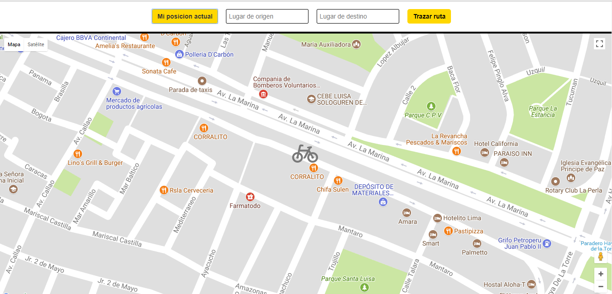

## EASY - VRECO
1. **Descripcion del proyecto:**
 - Este proyecto contiene un página web en la que se puede obtener la ubicacion actual del usuario y trazar una ruta desde dos puntos distantes gracias a la api geolocation y google maps.

2. **Autores:**

 - Lilliam Haro
 - Elena Japa

2. **Herramientas utilizadas:**

 - HTML5
 - CSS3
 - javascript
 - Google maps

**Trazado de rutas:**

**Ubicacion actual del usuario**

